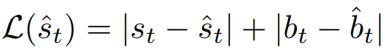
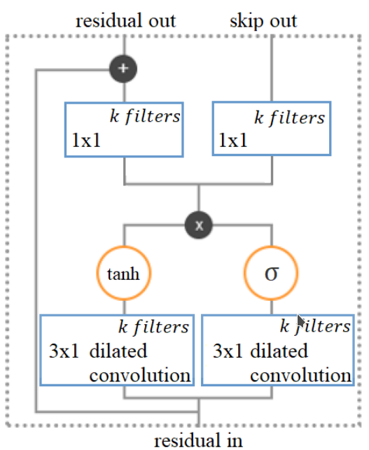
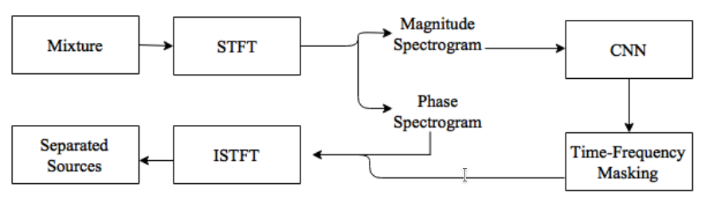

# End-To-End Music Source Separation: Is it possible in the waveform domain?

Explores the time-domain by arguing that spectrum based techniques ignore the phase of the signal, studying the viability of having a time end-to-end model for music source separation.

They propose a Wavenet-based model and benchmark it against other models like DeepConvSep and a Wave-U-net to prove this is possible.

## Introduction

- Waveform domain preserves all the information available in the raw signal, but it is rare to find identical waveforms by the same sound source (since phase information is unpredictable).
- If we consider solely the magnitude or power spectrograms the phase related problems disappear (since similar realizations of the same sound, although different on phase, have similar representation in the time-frequency plane).
- Even using frequency information the phase is still needed to reconstruct the waveforms in the time-domain (generally the original mixture phase is used). 
- Power spectrograms are additive and can approximate time domain summation, but magnitude ones don't.
- There is discarded information in the phase domain and also the use of the original mixture phase can theoretically limit performance and introduce artifacts.
- In the waveform domain, we have high dimensionality, making it hard to model.

## End-To-End Source Separation Models

### Proposed Wavenet-based Model

- It is based on "A wavenet for speech denoising":

- The non-causality is justified because in speech denoising **some future samples are generally available to help make more well-informed predictions**.
- A softmax output is removed and the **raw audio is used without any preprocessing**.
- A two-term loss is used to enforce energy conservation. The background-noise signal is estimated by subtracting the denoised speech from the mixed input:  (sum of the absolute difference between speech and predicted speech and background and predicted background) **loss is directly representative of the task**.
- **Turns the model it into a non-causal model**, allowing it to become **discriminative and parallelizable** (whereas the original Wavenet is generative and slow).
- Model is **no-longer autoregressive**, enforcing the time continuity of the signal:
- It is able to predict a full target field instead of a sample at each time.
- The original wavenet had two final layers with 1x1 filters that produced sporadic point discontinuities. By replacing it with 3x1 filters solved this problem.
- Augmentation was used with noise only audio samples (since the model was unable to produce silence).
- Each layer has a residual input and residual and skip-connection outputs:

- The dilation factor in each layer increases in the range of 1, 2, ..., 256, 512. Then it restarts again for N times.
- Adam optimizer used with a learning rate of 0.001
- Trained with early stopping.

### DeepConvSep

- State-of-the-art spectrogram based method. 

- It has an encoder-decoder convolutional architecture.
- It has vertical filters to capture timbral representations and horizontal to model temporal cues. 
- Mean Squared error loss used, but the authors notice that an adjustment to the loss improved the results. This loss has three different terms added to the MSE:
    1. a term for differences between different instrumental sources s such as ’vocals’ and ’other’, ’bass’ and ’other’, and’drums’ and ’other’.
    2. a term for the difference between the estimated vocals and the other stem
    3. a term representing the difference between the estimated sources.

### Wave-U-Net

Already have notes on this on this paper on this repo.

## Experimental Results

- **A dissimilarity loss term is added** to the loss to reduce the interferences from other sources (one of the terms used in DeepConvSep). This loss term **does not improve the results in music source separation**. **In voice source separation it does seem to improve** the results. 
- **Deeper models outperform wider ones** (in Wavenet based models). This may due that wider models have a lot more parameters and overfit the training set. The small receptive field of these models can also hurt the performance. 
- In a perceptual test with humans (subjects classified samples from 1-5 to evaluate the interferences), Wavenet outperformed DeepConvSep and this is also consistent with the other metrics. 
- **Wave-U-Net seems to outperform Wavenet** in singing voice source separation. 
- Proposed Wavenet has comparable results with a lot less parameters than Wave-U-Net.

## References

- Lluís, Francesc, Jordi Pons, and Xavier Serra. "End-to-end music source separation: is it possible in the waveform domain?." arXiv preprint arXiv:1810.12187 (2018).
- Rethage, Dario, Jordi Pons, and Xavier Serra. "A wavenet for speech denoising." In 2018 IEEE International Conference on Acoustics, Speech and Signal Processing (ICASSP), pp. 5069-5073. IEEE, 2018.
- Chandna, Pritish, Marius Miron, Jordi Janer, and Emilia Gómez. "Monoaural audio source separation using deep convolutional neural networks." In International Conference on Latent Variable Analysis and Signal Separation, pp. 258-266. Springer, Cham, 2017.