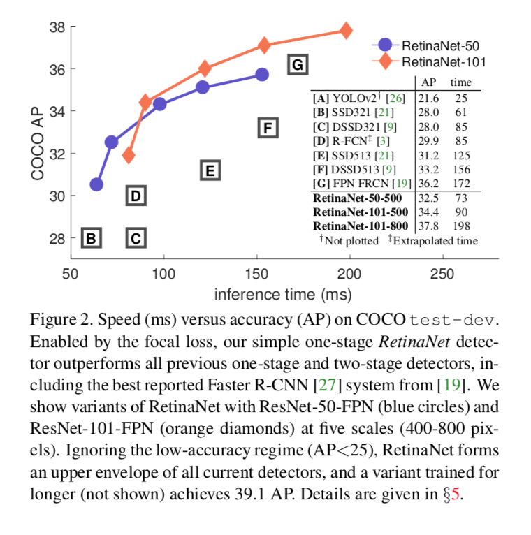

# Focal Loss for Dense Object Detection

Introduces a one-stage detector RetinaNet that prevents the vast easy negatives on architectures like R-CNN, achieving fast object detection and surpassing the accuracy of all the two-stage detectors.

According to the authors, the **problem of not achieving the same AP as two-stage detectors** is due to the **class imbalance** on training phase. The proposed **focal loss eliminates this barrier**. 

The authors borrow a lot of similarities to other works namely:
- Anchors proposed by a Region Proposal Network (RPN)
- Feature Pyramids as in Feature Pyramid Nets (FPN) and Single Shot Multibox Detector (SSD)

The improvement in performance is not due to architectural improvements but to the proposed loss function.

In R-CNN-based detectors, the class imbalance is solved by a two-stage cascade (that filters most background samples) and sampling heuristics in the second phase (that maintains the balance of foreground and background samples). In the previously proposed one-stage detectors, the class imbalance is big (_10_4_-_10_5_ candidates per image, but only a few of them have objects). This imbalance makes training inefficient since most regions are easy negatives and in big proportions can harm the performance of the models. 

## Focal Loss

Binary Cross-Entropy: 

Even examples that are **easy classified** (p > 0.5) have a **loss that is significant**. **When summed together they can overwhelm rare classes**. 

To address this it can be added a weight factor alpha ([0-1]) for each class (set as the inverse of class frequency ratio or as a hyperparameter). This extension of Cross-entropy is used as a baseline for comparing with Focal Loss. 

**The alpha does not differentiate between easy and hard examples.**  

To avoid the dominance of gradients from easy classified negatives they proposed the **focal loss**:

- Allows **efficient training without sampling** and harming the performance.
- Designed to **dow-weight inliers** (easy examples) such that **their contribution to the loss is small** event if the confidence is high, focuses on a sparse set of hard examples.
- With this loss:
  1. A misclassified example with small probability, the loss is not much affected. As the probability tends to 1, and the examples are down-weighted.
  2. **γ adjusts smoothly the down-weight** of easy examples.
  3. With **γ = 0**, we have the traditional **Cross-Entropy** loss.

In practice, the authors use an **α-balanced Focal Loss**, as it improves the overall metrics of the system:

### Prior Probability parameter

- Generally, models have an equal probability of classifying both classes and the imbalance on training leads to the most frequent class dominating the loss. 
- **A prior for the predicted probability** p is proposed: **π is set to a low value for the rare class**. This is a model parameter and not part of the loss.

## RetinaNet

  
- Composed by a **pre-trained backbone network** (Feature Pyramid Network over ResNet) responsible to **extract features** from the **entire input image**. The FPN:
    1. creates a top-down pathway and lateral connections, creating a multi-scale feature pyramid from the entire image.
    2. Compared to the original FPN, the authors:
       1. do not use Pyramid level 2
       2. Level 6 uses strided-convolutions instead of down-sampling
       3. Level 7 is included to increase large object detection
- Simple **Resnet without FPN leads to low AP**.
- **Anchors** of **different areas** (32x32 to 512x512),**different aspect ratios** (1:1, 1:2, 2:1) are used. To increase the scale coverage at each pyramid level anchor sizes of 2^0^, 2^1/3^ and 2^2/3^ are also used. This means that there are **9 anchors per pyramid level** covering the scale range from 32 to 813 pixels in the input image. 
- One **subnet classifies each anchor** and **the other** one does **regression to estimate the bounding box**.
- The classification subnetwork is fully convolutional using only 3x3 filters.
- In training, anchors are assigned as the ground truth objects if the Intersection over Union (IoU = Overlap Area / Union Area) is greater than 0.5 (and background if it is < 0.4). If an anchor has IoU between 0.4 and 0.5 it is unassigned and ignored in training. 
- The bounding box regression subnet is also fully convolutional that tries to regressing the offset of the anchor to the closest ground-truth object (if existent). 
- The regression subnet is **identical** but **not sharing parameters** to the classification with the exception of the final layer having 4 outputs with linear activations. 
- The **regression net is class-agnostic**, unlike prior works.
- To improve the speed of inference, **only uses the top 1k predictions per pyramid level**, after thresholding the confidence at 0,05. After this, the predictions of all levels are fused and a **non-maximum suppression** is applied with a threshold of 0.5 to get the final detections.
- The authors find that in the focal loss γ = 2 works better, but the RetinaNet is robust to values between [0.5, 5].
- The focal loss is applied to all ~100k anchors with no resampling. The total loss is the sum of all focal losses in all anchors, normalized by the number of anchors assigned to a ground-truth object. 
- γ and α are closely related and should be tuned together. In practice **when γ is increased, α should be decreased.**
- The convolutional layers (except the **last conv layer of the classification subnet**) in the subnetworks are initialized with bias of zero and Gaussian weights with a sigma of 0.01. The final convolution is **initialized with a bias of b = -log((1 − π)/π)**, where **π** is the **prior confidence** as discussed before.
- SGD is used as optimizer
- All models trained for 90k iterations with a learning rate of 0.01 for the first 60k iterations, 0.001 between 60k and 80k, and finally 0.0001 in the last 10k iterations. 
- Only horizontal flipping is used as augmentation
- Weight decay of 0.0001 is used with a momentum of 0.9.
- **Total loss is the sum of Focal loss and L1 loss** in the bounding box regression. 

# Results

- Using **standard cross-entropy** without modifications in RetinaNet makes the training to **diverge**. The inclusion of the prior parameter π in the model solves this divergence.
- α-Balanced CE with α of 0.75 gives a boost on AP of 0.9.
- With γ = 2, the AP is improved by 2.9 points over the α-Balanced CE.
- Changing γ has much more effect than α. 

- The **fraction of foreground examples is similar for different values of γ**. 
- The **fraction of background examples is quite different for different values of γ**, whereas with **γ = 2, the vast majority of the loss contribution comes from a small fraction of samples**. 
- Hinge Loss was unstable on the experiments.
- **Best results with 2 scales and 3 aspect ratios** for each position in each pyramid level. 

- Larger backbone networks have higher AP, but also slower inference speeds.
- **Surpasses all two-stage detectors**.
- YOLOv2 is still a lot faster, but RetinaNet has a bigger inference speed that other One-stage methods. 
- **Achieves State-of-the-art on test-dev COCO dataset** with a 5.9 improvement in AP. this can also been improved if the backbone used is ResNeXt-32x8d-101-FPN. 

## References

- Lin, Tsung-Yi, Priya Goyal, Ross Girshick, Kaiming He, and Piotr Dollár. "Focal loss for dense object detection." In Proceedings of the IEEE international conference on computer vision, pp. 2980-2988. 2017.