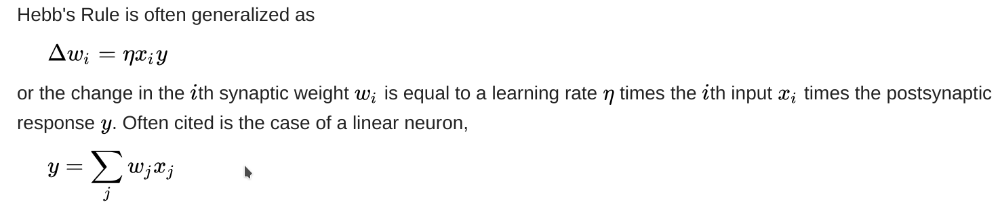
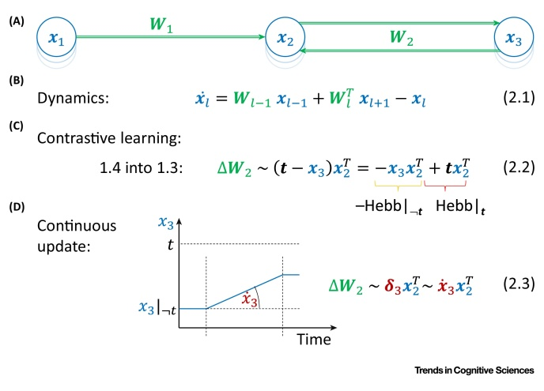
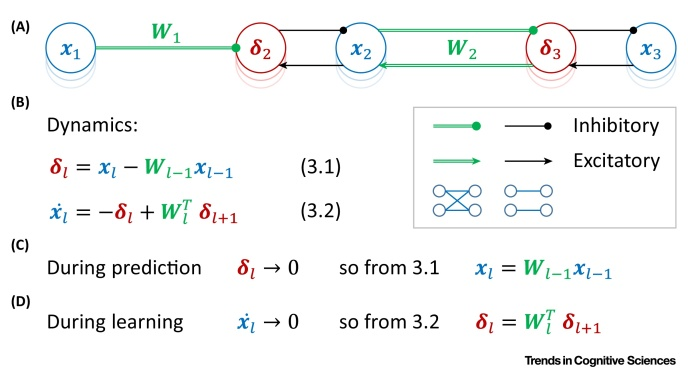
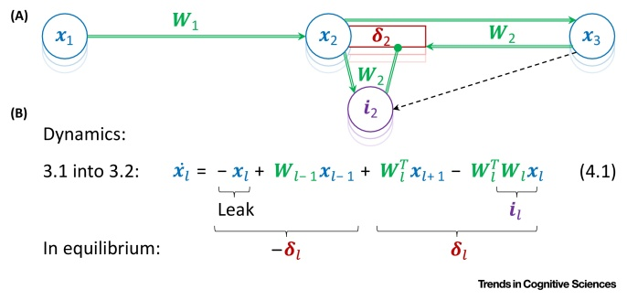
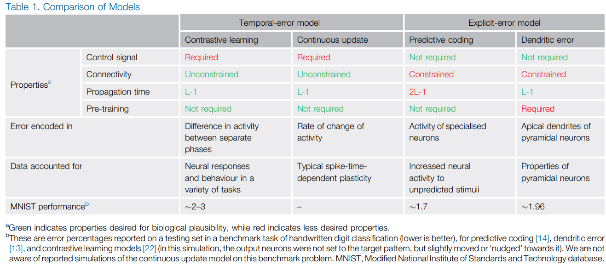

# Theories of Error Back-Propagation in the Brain

Review article of theories on how brain neural circuits can be seen as neural nets error back-propagation algorithm. 

## Introduction and context

- It has been demonstrated that artificial neural networks (ANN) when trained to perform tasks such as image classification, learn representations in their neurons similar representations to those seen in the brain in areas related to those tasks. This suggests that the brain may use similar algorithms.
- Despite the ANNs were inspired in the brain, the weight learning process during training seems biologically unplausible. 
- Some authors propose an efficient learning algorithm with simple plasticity rules (synaptic plasticity is the ability of synapses to strengthen or weaken over time, in response to increases or decreases in their activity).
- Over the past 30 years, it has been defended that Error back-propagation is hard for the brain to implement.

### Biologically Questionable Aspects of the Back-Propagation Algorithm

1. **No Local Error Representation**: without local representation, each synaptic weight depends on the activity and computations of all downstream errors. Biological neurons change their connection strength solely on local signals.
2. **The symmetry of forwards and backwards weights don't always make sense**: in ANNs the backpropagated errors use the same weights as the forward pass, suggesting identical connections in both directions. In biological neurons, this bidirectional connections are common but not always present!
3. **Outputs are not biological plausible**: ANNs have neurons with continuous output, whereas biological neurons use spikes. Using this spike patterns in backpropagation is non-trivial since it is unclear how to compute the gradients.

## Models of Biological Back-Propagation

- Early theories suggested that synaptic plasticity is driven by a global error signal carried by neuromodulators (Neuromodulators are neurotransmitters that diffuse through neural tissue to affect slow-acting receptors of many neurons. Examples are dopamine, serotonin, etc.). The problem with this approach is that learning in these models is slow and does not scale with bigger networks.
- More recently biological models that represent local error have been proposed and perform similarly in MNIST for examples.
- Some authors addressed the question of symmetry of weights by proving that even if the errors in ANNs are back-propagated by random connections a good performance can be achieved.
- It has been proven that spike neural networks can use a generalized backpropagation algorithm. 
- Another study proposed that when biologically realistic neurons are used, they may approximate small ANNs in their dendritic structure.
  
The paper reviews some biologically plausible models:

1. They work without **minimal external control** since they can compute local errors through the dynamics of the network.
2. They consider **spike time-dependent plasticity** of neurons.
3. They consider the **properties of pyramidal neurons** and cortical microcircuits. 
4. They include both **feedforward and feedback connections** (that allow them not to require an external program to calculate the errors).
5. They use energy-minimization models.

### Temporal-Error Models

They encode errors of different neural activities across time.

#### Contrastive Learning

Is one of the proposed models. It suggests that the weights can be decomposed in two different updates:

  1. Update based on the activity without the target:
     - **anti-Hebbian plasticity**: synaptic weight is proportional to the negative product of the activity of the pre and postsynaptic neurons
     - If both neurons have high activations then the weight of the connection is reduced.
     - Unlearns the existing association between target and input.
  2. Update based on the target provided to the output neurons.
     - **Hebbian plasticity**: weight modifications are proportional to the product of the activity of the pre and postsynaptic neurons.
     - Tries to learn the new association between input and target.
  
  

The neurons in the output layer are driven by the feedforward phase and then forced to take the target value in another phase.

This model involves locally error estimation but biologically it would involve a global signal to determine the phase of the updates (Hebbian and anti-Hebbian). It is not been proven that this signal exists in the brain.

#### Continuous Update Model

- Here the **output activities are gradually changed from the prediction to the target**.
- The rate of change is proportional to the error terms. The **weight change could then be driven by local plasticity** (based on local activity change rate). The weight modification is equal to the product of the presynaptic activity and the rate of change of the postsynaptic activity.
- **Does not involve two learning phases** as Contrastive Learning.
- It still **depends on a control signal** when the target is present (since local plasticity does not occur during prediction phase).

(A) Network architecture. (B) Dynamics. (C) Contrastive learning. (D) Continuous update.

### Explicit-Error Models

Models that do not require control signals but have more complex architectures.

#### Predictive Coding Models

- Models of information processing in hierarchical cortical circuits and originally created for unsupervised learning.
- It learns similar representations to the visual cortex when trained with images.
- It has been used as a general framework for describing different types of information processing in the brain.
- It is been shown that it is used in supervised learning and it is closely approximated by back-propagation.
- Contains **error nodes** and the corresponding **value nodes** (Blue and red circles denote the value and error nodes, respectively):

_Arrows and lines ending with circles denote excitatory and inhibitory connections, respectively; green double lines indicate connections between all neurons in one layer and all neurons in the next layer, while single black lines indicate within layer connections between a corresponding error and value node_

- In **prediction phase**, the input is fed to the network and the activity is propagated through the value nodes via the error nodes. The equilibrium is achieved when the error nodes decay to zero and all value nodes converge to the same values as the corresponding ANN.
- In the **learning phase** both input and output layers are set to the training patterns. The error nodes no longer decay to zero but they instead converge to values as if the errors had been back-propagated. After reaching equilibrium the weights are changed according to the **Hebbian plasticity** rule.
- The **weight changes are close to the ones seen in the back-propagation algorithm**.
- They work autonomously, independently of the input pattern given.
- The **one-to-one connectivity of error nodes with their value nodes is biologically inconsistent** with the patterns observed in the neuronal connectivity of the cortex.

#### Dendritic Error Model

- **Error is represented in the dendrites of the corresponding neuron**.
- Describes networks of pyramidal neurons by **assuming that errors in their activity are computed in their apical dendrites**.
- Apical dendrites compare higher-level feedbacks with a local prediction of higher-level activity computer via interneurons:

_Dendritic Error Model. (A) Network architecture. Blue circles indicate pyramidal neurons, red rectangles indicate their apical dendrites, and purple circles denote interneurons. (B) Dynamics._

- It is **closely related to predictive coding models**: it is described by a simple rearranging the dynamics of predictive coding to produce a model where the dendrites compute the error. 
- The dynamics of this model includes 4 terms:
  1. a simple decay term
  2. a second term with a feedforward input from the previous layer
  3. term containing feedback from the layer above
  4. fourth term containing a within layer recurrent output.
- Weight updates are challenging since **interneurons must learn to produce activity encoding the same information as the higher level pyramidal neurons**. To allow this the interneurons have one-to-one connections from higher-level neurons.
- The weight updates correspond to local synaptic plasticity.
- Error information can be transmitted from the apical dendrite to the rest of the neuron through internal signals (Recent studies suggest that the errors encoded in these dendrites can determine the plasticity of the whole neuron).
- Before the network learns the feedforward connections, the interneurons need to be pre-trained (although they can be learned in parallel).
- These models are **biologically plausible**, while still approximating the backpropagation algorithm.

## Comparison of models

- The temporal-error models need a control signal while explicit-error models do not.
- Temporal-Error models have simpler architectures
- The Explicit error models include one-to-one connections but there is no evidence of their existence in the neocortex.
- Predictive coding is slower due to the error nodes.
- **Contrastive Learning has been shown to reproduce neural responses in a variety of tasks**.
- **Continuous Update Model can be implemented with spike-time-dependent plasticity**, i.e. the increase or decrease of modification depends on whether the spike of a presynaptic precedes of follows the postsynaptic spike.
- A study shows that learning in the **predictive coding model can arise from an alternate form of spike-time-dependent plasticity**. The weights are increased by nearly coincident pre and postsynaptic spikes, irrespectively of their order, and additionally, the weight is decreased by each presynaptic spike.
- **Dendritic-Error models describe the computation of pyramidal neurons** and they are biologically realistic.

## Integrating models

- Cortical Circuitry is much more complex than these models.
- The models described only can be considered as descriptions of learning of more complex brain networks.
- **Different models are more suited for specific tasks**:
   1. For predicting the next value of sensory input from the previous one the most suited should be the temporal-error models.
   2. Explicit-Error models are more indicated for tasks where the timing of the pattern presentation is uncertain.
- It is conceivable that cortical networks include elements of predictive coding in addition to dendritic error ones (predictive coding for fast learning and dendritic error models for fast information processing).
- Predictive coding may describe information processing in subcortical parts of brain networks.
- **Temporal-Error models** under certain assumptions, converge to an equilibrium in which strongly connected neurons have similar levels of activations. They minimize an energy function called **Hopfield energy**.
- **Predictive coding** also minimize a **Free Energy function**. It has a statistical interpretation since its negative provides a lower bound on the log probability of a target prediction. This may indicate why these networks have better performance in MNIST. 
- All models can be seen as **energy-based models** described by the equilibrium propagation framework.
- This framework shows that the weight modifications of the models described following this rule of energy minimization, and how this can be used to combine models while also minimizing the energy function.
- Energy function affects performance.

## Conclusions

- Weight symmetry problem is not solved by these models.
- It is unclear how to scale these models to complex problems.
- The models described the use of static inputs, whereas the brain receives dynamic sequential inputs. 

## References
- Whittington, James CR, and Rafal Bogacz. "Theories of error back-propagation in the brain." Trends in cognitive sciences (2019).