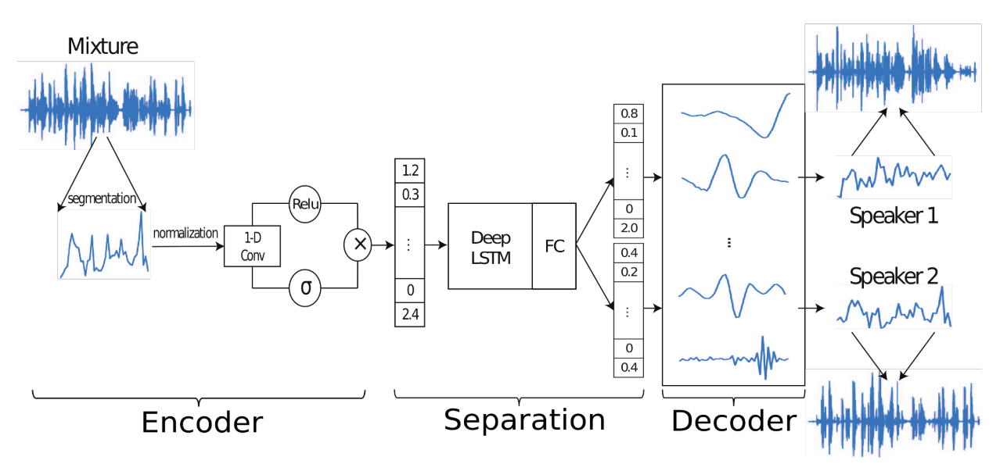
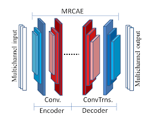
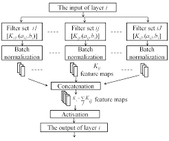

# Wave-U-Net: A Multi-scale Neural Network for End-to-End Audio Source Separation

Proposes an adaptation of U-Net to the one-dimensional domain (time-domain) to perform audio source separation. 

Why time-domain?

- Most models operate on magnitude spectrum with a fixed spectral transformation and they ignore phase information
- In time-domain, the model should be able to model phase information without using a fixed spectral transformation.

## Introduction

Most methods almost exclusively operate on frequency domain :

1. Apply Short-Time Fourier Transform (STFT) to input signal, generating a complex-valued spectrogram
2. The spectrogram is split into its magnitude and phase components
3. The model only uses magnitude and predicts the output magnitude spectrogram for the individual sound sources
4. Then the magnitudes are combined with the mixture phase information
5. An inverse STFT is applied to the spectrogram to generate the individual audio signals

Some authors also recover the individual phase information using the Griffin-Lim algorithm. This iterative algorithm works as follows:

1. Start with a complex-valued spectrogram with the desired magnitude but with the imaginary part with uniform noise (no phase information)
2. Perform Inverse STFT (ISTFT) to obtain an audio signal based on magnitude information
3. Apply STFT to the generated audio signal, getting a spectrogram with some imperfect phase information.
4. On the generated spectrogram replace the real part with the original magnitude spectrogram.
5. Redo Step 2

The process is done several times until some end criteria. The phase information will iteratively be more relevant.

The frequency domain has several limitations:

- It is dependent on parameters as the size and overlap of audio frames, affecting time and frequency resolution.
- These parameters need to be optimized as an additional hyperparameter of the model since they will affect the performance (although generally these are fixed to specific values).
- Since phase estimation is not included, the phase is assumed incorrectly to be the same as the initial mixture (which is incorrect for overlapping partials)
- Even if Griffin-Lim algorithm is used, this method is slow and often no such signal exists. 

These reasons are behind why the authors claim that the phase information should be included in the model separation.

# Related Work
The authors identify some related papers that also explore time-domain.

**TasNet (Time-domain audio separation Network)**

- Focused on real-time speech separation task. 
- It proposes an encoder-decoder framework  with four parts: a preprocessing normalization module, an encoder for estimating the mixture weight, a separation module, and a decoder for waveform reconstruction:
  
    1. Input audio is normalized to have unit _L^2^_ norm. 
    2. An encoder tries to estimate the nonnegative mixture weights for each segment using a 1-D gated convolutional layer (similar to the paper on Language modeling with gated convolutional networks)
    3. A deep LSTM whit identity skip-connections followed by a fully-connected layer works as the separation network and is used to estimate the source masks that indicate the contribution of each source to the mixture weight.
    4. A Transposed Convolution is done with N 1-D filters to recover the temporal information
    5. The  _L^2^_ normalization is inverted to obtain the final separated sources.

**MR-CAE (Multi-Resolution Convolutional Auto-Encoder)**

It uses a convolutional autoencoder with layers composed by different sets of filters. Each set has filters of different size that try to capture different features:

These filters are then concatenated before the activation layers (ELU) and after batch normalization in each set of filters. They do not apply any pre or post processing on the audio signals. The network is trained on input signals of 1025 length and the filters chosen have sizes of 5, 50, 256, 512 and 1025. In the decoder part, the process is repeated with Transposed Convolutions.

## References

- Stoller, Daniel, Sebastian Ewert, and Simon Dixon. "Wave-u-net: A multi-scale neural network for end-to-end audio source separation." arXiv preprint arXiv:1806.03185 (2018).
- Luo, Yi, and Nima Mesgarani. "TasNet: time-domain audio separation network for real-time, single-channel speech separation." In 2018 IEEE International Conference on Acoustics, Speech and Signal Processing (ICASSP), pp. 696-700. IEEE, 2018.
- Yann N Dauphin, Angela Fan, Michael Auli, and David Grangier, “Language modeling with gated convolutional networks,” arXiv preprint arXiv:1612.08083, 2016.
- Grais, Emad M., Dominic Ward, and Mark D. Plumbley. "Raw Multi-Channel Audio Source Separation using Multi-Resolution Convolutional Auto-Encoders." In 2018 26th European Signal Processing Conference (EUSIPCO), pp. 1577-1581. IEEE, 2018.